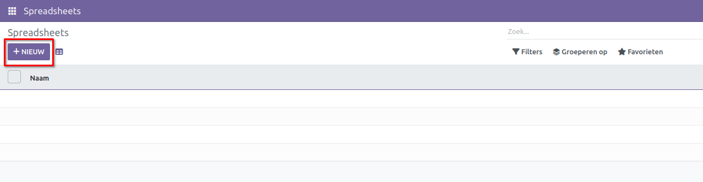
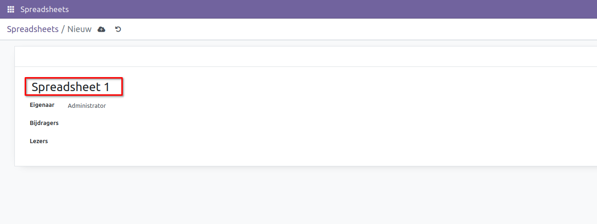
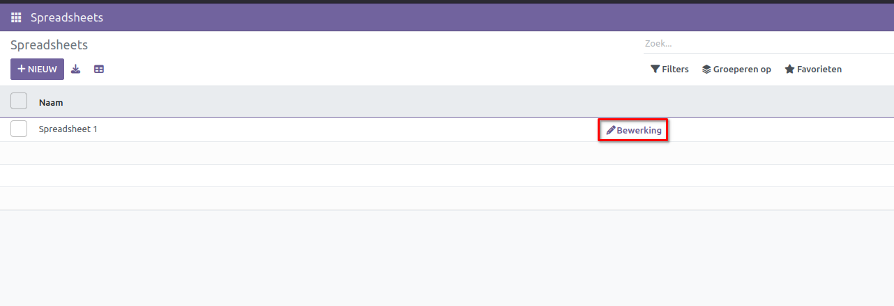
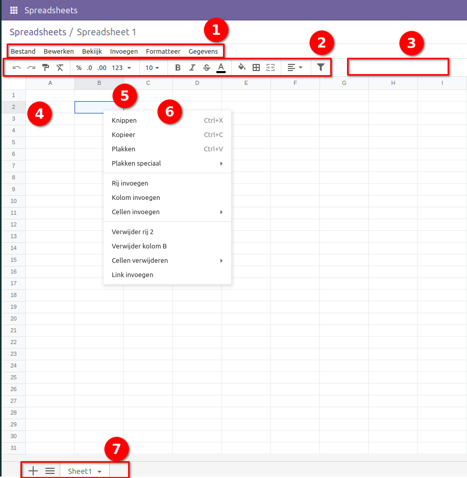

===========
Spreadsheet
===========
Een spreadsheet stelt je in staat om je gegevens in tabelvorm te organiseren, analyseren en visualiseren 

Hoe maak je een nieuw spreadsheet?
-----------------------------------
Je kunt een spreadsheet maken door op de knop "Nieuw" te klikken.

Voer de naam in van het spreadsheetbestand dat aangemaakt moet worden. 

De overzichtspagina toont alle aangemaakte spreadsheets. 

Je kunt elk aangemaakt spreadsheetbestand bewerken door de optie "Bewerking" te selecteren.

Woordenlijst
=============

Enkele van de belangrijkste elementen van een spreadsheet worden hieronder uitgelicht en gedefinieerd.

Menubalk
--------
1) Bovenbalk
2) Formulebalk
3) Filterknop
4) Rijkop
5) Kolomkop
6) Cellenmenu
7) Onderbalk

Functies
---------

Spreadsheetfuncties zijn onderverdeeld in de volgende categorieën:

- Database
- Date
- Engineering
- Financial
- Info
- Logical
- Lookup
- Math
- Misc
- Odoo
- Operators
- Statistical
- Text
