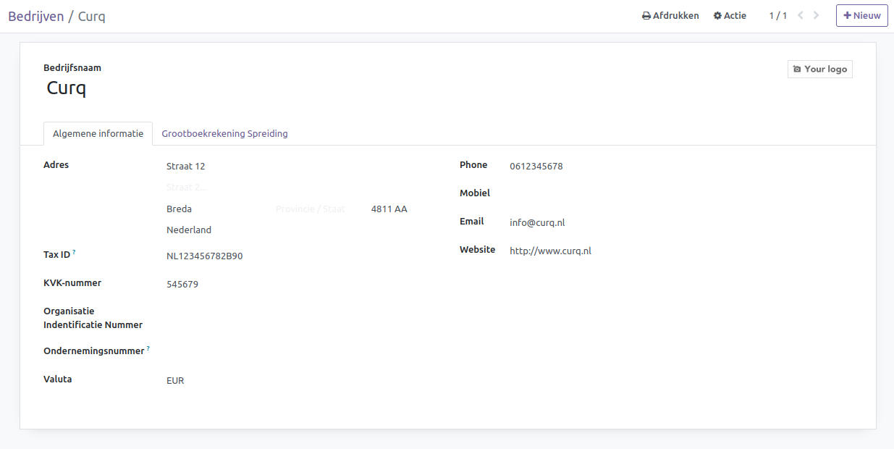

Starten met boekhouding
==

Om te beginnen met de boekhouding in Odoo volgen we deze stappen

1. **Bedrijfsgegevens configureren:**

    * Ga naar de instellingen van jouw bedrijf in Curq. Je kan deze instellingen benaderen via Instelligen > Gebruikers & Bedrijven > Bedrijven. Open uw bedrijf en configureer uw bedrijfsgegevens.
      
      
1. **Boekhoudingsinstellingen configureren:**

    * Ga naar de boekhoudingsinstellingen in Odoo. Meestal kunt u dit vinden in het "Accounting" of "Boekhouding" gedeelte van de financiële app. Controleer of de datum voor de

2. **Bankkoppeling:**

    * Als je bankrekeningen heeft, kan je deze koppelen aan Curq om transacties automatisch te importeren en af te stemmen. De koppeling maakt gebruik van de dienst van Ponto. Ponto is een service provider die jouw bankrekening doorstuurt van jouw bank naar Curq.

3. **Belastinginstellingen configureren:**

    * Configureer de belastinginstellingen op basis van uw locatie en bedrijfsactiviteiten. In Curq zijn de standaard BTW codes al ingericht voor NL (hoog en laag), voor binnen de EU en voor buiten de EU.
    
4. **Grootboek Rekeningschema:**

    * Curq laad de benodige Nederlandse Rekeningschema in voor uw bedrijf. Dit omvat onder andere grootboekrekeningen, debiteuren- en crediteurenrekeningen, en andere financiële categorieën. Het is ook mogelijk om een grootboekschema conform RGS (Referentie GrooboekSchema) toe te voegen. RGS is het grootboekrekeningschema dat is gebaseerd op een gestandaardiseerde codering van financiële gegevens.

Houd er rekening mee dat het instellen van boekhouding in Curq enigszins kan variëren, afhankelijk van uw specifieke behoeften.
